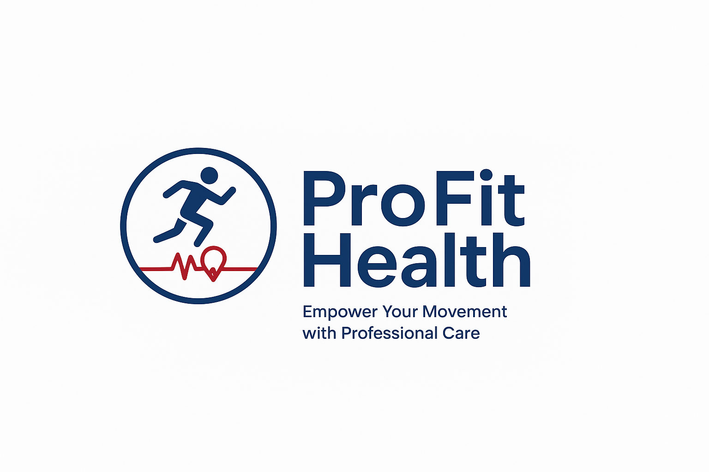

# ProFit Health 跨健康與運動管理之智慧健康運動促進平台
## ProFit Health: Smart Health & Sports Promotion Platform for Integrated Health & Exercise Management



> **從數據追蹤到專業介入 — 打造「紀錄 → 分析 → 回饋」的健康管理閉環**
> *From Data Tracking to Professional Intervention — Building a Closed-Loop Health Management System: "Track → Analyze → Respond"*

---

## 專案簡介 / Project Overview
ProFit Health 是一套整合「運動紀錄、健康數據分析與專業指導」的智慧健康促進平台。

現今多數健康管理應用僅提供資料記錄功能，缺乏持續動機與專業介入，導致使用者難以長期維持運動習慣。本系統透過導入**「專家介入機制 (Expert-in-the-Loop)」**，建立 **紀錄 (Tracking) → 分析 (Analysis) → 回饋 (Feedback)** 的健康管理閉環系統，協助使用者從被動記錄轉變為主動健康管理。

*ProFit Health is a smart health promotion platform that integrates exercise tracking, health data analysis, and professional guidance. By introducing an Expert-in-the-Loop mechanism, this system establishes a closed-loop system to help users transition from passive logging to active health management.*

---

## 核心價值 / Core Values

* **數據驅動 (Data-driven)**：透過儀表板 (Dashboard) 分析 BMI 趨勢與運動統計，量化健康進展。
* **專家介入 (Expert-in-the-loop)**：教連與醫師提供個人化健康建議與任務指派。
* **閉環管理 (Closed-loop)**：形成「數據 → 分析 → 行動 → 再優化」的持續改進循環。
* **多角色系統 (Multi-role System)**：整合使用者 (User)、專業人員 (Expert) 與管理者 (Admin) 三方協作生态。

---

## 系統角色 / System Roles

### 1. User (一般使用者)
記錄運動與健康生理資料、查看儀表板視覺化分析、設定個人目標（步數/時間/卡路里），並可線上向專業專家進行提問 (Q&A)。
*Log exercise and health data, view dashboard analysis, set personal goals, and ask experts questions.*

### 2. Expert (專業人員)
遠端查看個案健康與運動資料、針對生理數據提供個人化回饋 (Feedback)、線上指派健康任務 (Task)，並解答使用者提問。
*View clients' health data, provide tailored feedback, assign fitness tasks, and answer user queries.*

### 3. Admin (管理者)
建立與管理專家帳號、執行專家與使用者之指派機制（一對多關係），並負責系統權限與核心參數控管。
*Create and manage expert accounts, assign experts to users, and control system permissions.*

---

## 主要功能 / Main Features

* **📱 使用者端功能 (User Features)**
  * **身分驗證**：基於 JWT 的註冊與登入驗證機制。
  * **運動紀錄**：精確記錄運動時間、步數、心率與卡路里消耗。
  * **軌跡地圖**：整合 Leaflet 地圖套件，實作 GPS 運動軌跡功能。
  * **健康紀錄**：提供體重記錄與 BMI 自動計算功能。
  * **數據視覺化**：動態展示今日狀態、30天達標率、週/月統計與 BMI 趨勢圖表。

* **🩺 專家系統 (Expert System)**
  * 個案健康管理儀表板 (Client management dashboard)。
  * 個人化健康任務指派 (Personalized task assignment)。
  * 生理健康數據整合分析 (Health data analysis)。
  * 即時專業回饋與引導建議 (Real-time feedback and guidance)。

* **⚙️ 管理系統 (Admin System)**
  * 專家帳號全生命週期管理 (Expert account management)。
  * 專家與使用者指派權限機制 (Expert assignment allocation)。
  * 系統核心權限控管與安全性設定 (System permission controls)。

---

## 系統架構 / System Architecture

本系統採用 **前後端分離架構 (RESTful API)** 開發。資料庫採用輕量化 **SQLite** 本地端儲存，具備無須額外配置、方便快速部署與完美展示的特性。


| 模組 (Module) | 技術與工具 (Technology) |
| :--- | :--- |
| **前端架構 (Frontend)** | HTML5 / CSS3 / JavaScript (Vanilla JS) |
| **後端架構 (Backend)** | Node.js + Express |
| **資料庫 (Database)** | SQLite |
| **身分驗證 (Authentication)**| JWT (JSON Web Token) |
| **圖表組件 (Charts)** | Chart.js |
| **地圖組件 (Map)** | Leaflet |

---

## 快速啟動 / Quick Start

運行本系統前，請確保您的電腦已配置 **Node.js** 執行環境。

### 1. 下載與安裝 Node.js (Download & Install)
* 請造訪 [Node.js 官方下載頁面](https://nodejs.org)。
* 建議選擇 **LTS（長期維護穩定版，如 v24.x 或更高）** 以確保最佳系統相容性。
* 執行安裝檔並依引導完成預設安裝（請務必勾選「自動配置環境變數 PATH」）。

### 2. 驗證環境配置 (Verify Environment)
開啟命令提示字元（或終端機）並輸入以下指令：
```bash
node -v
npm -v
```
*✔ 若正確顯示版本號（例如 `v24.15.0` 與 `11.x.x`），即代表開發環境配置成功。*

### 3. 啟動健康促進平台 (Launch Platform)

#### 【方法 A】一鍵啟動（推薦展示使用）
直接雙擊執行專案根目錄下的批次檔：
```bash
start.bat
```
*系統將自動偵測環境、補全後端相依套件 (`npm install`)，並自動為您開啟網頁介面。*

#### 【方法 B】手動指令啟動（開發與偵錯使用）
若批次檔未正常運作，請於終端機手動執行以下指令：
```bash
cd backend
npm install
node index.js
```
啟動成功後，請開啟瀏覽器造訪：[http://localhost:3000](http://localhost:3000)

---

## 專案結構 / Project Structure

```text
health-promotion-platform/
│
├── backend/          # 後端 Express 原始碼與 SQLite 資料庫
├── frontend/         # 前端網頁靜態資源 (HTML/CSS/JS)
├── start.bat         # 一鍵啟動批次腳本
├── stop.bat          # 一鍵關閉批次腳本
├── README.md         # 專案說明文件
└── logo.png          # 平台標誌標籤
```
*註：系統內建 `health.db` 測試資料庫，提供虛擬測試帳號，不包含任何真實個人健康識別資料 (PII)。*

---

## Demo 演示流程 / Demo Workflow

1. 執行 `start.bat` 啟動系統，瀏覽器會自動開啟或手動造訪 `http://localhost:3000`。
2. 登入 **User（使用者）帳號**：新增每日運動紀錄與生理資料，檢視儀表板圖表與目標達標率。
3. 切換至 **Expert（專家）帳號**：進入個案管理面板，查閱該使用者的歷史趨勢圖，並給予專業回饋或指派專屬任務。
4. 展示 **Admin（管理者）後台**：演示將特定使用者重新指派給其他專家的調度與權限控管機制。
5. 完整呈現「數據紀錄 → 視覺化分析 → 專業介入指導」的智慧健康促進閉環。

---

## 專題亮點與未來發展 / Project Highlights & Roadmap

### 專題亮點 (Project Highlights)
*  **多角色健康生態系**：專為 User、Expert、Admin 量身打造的完整工作流。
*  **全棧數據視覺化**：前端與 SQLite 資料庫完整串聯，並由 Chart.js 驅動豐富圖表。
*  **軌跡與計步整合**：利用 Leaflet 地圖套件實作實時 GPS 運動軌跡追蹤。
*  **一鍵自動化部署**：透過自訂 Batch 腳本實現極簡化的一鍵啟動與環境建置。

### 未來發展藍圖 (Future Roadmap)
* **AI 健康預警機制**：導入機器學習演算法，針對異常生理數據進行自動化健康風險預警。
* **穿戴式裝置全面對接**：串聯對接 Mi Fitness、Omron Cloud、Apple HealthKit 及 Google Fit 等主流健康 API。
* **進階資安與隱私防護硬化**：
  * 實作多因素身分驗證 (MFA) 與電子郵件開通驗證機制。
  * 機敏生理與健康數據採用 **AES-256 靜態加密儲存 (Data-at-Rest Encryption)**。
  * 導入 API 流量限制 (Rate Limiting) 與 Helmet.js 安全硬化防禦。
  * 建立完整的操作審計日誌 (Audit Logs)，以符合健康醫療個資法規法遵。

---

## 作者 / Author
**Nancy Lee**  
資訊管理學系 畢業專題作品  


